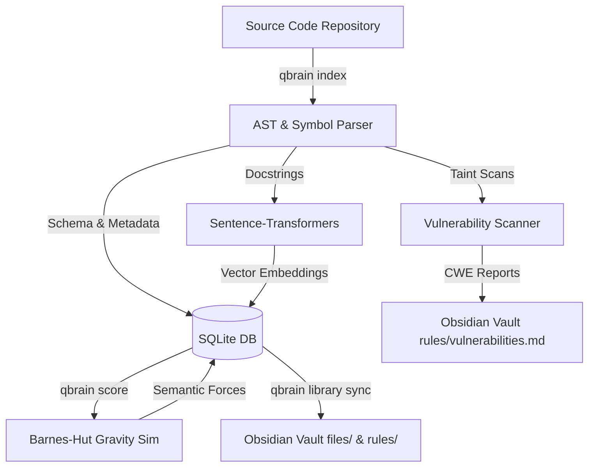

# Quantum Brain (`quant-blm`)

`quant-blm` (Quantum Brain) is a hybrid codebase intelligence, semantic mapping, and vulnerability scanning engine. By combining abstract syntax tree (AST) code parsing, N-body gravitational force simulation (Barnes-Hut), vector semantic embeddings, and dynamic control-flow taint analysis, `quant-blm` maps repository structure and behavior directly into an interactive local Obsidian Knowledge Vault.

---

## 🚀 Key Features

* **Codebase Indexing & AST Analysis**: Extracts multi-language (Python, TypeScript, PHP) symbol schemas, docstrings, internal imports, API endpoints, and dependencies.
* **Semantic Vector Search**: Local vector search over extracted docstrings utilizing `sentence-transformers` for cosine similarity matching.
* **N-Body Gravity Simulation**: Simulates codebase connectivity where tightly coupled or entangled symbols experience gravitational attraction, and disparate systems repel.
* **Unified CWE Vulnerability Audit**: Scans codebases for CWE Top 40 vulnerabilities (Missing/Incorrect Authorization, Sensitive Log Exposures, Hardcoded Credentials, Resource Exhaustion, Taint-to-Sink flow checks for XSS/SQLi/Command Injection).
* **Obsidian Vault Syncer**: Generates Obsidian markdown pages containing symbol definitions, behavior flows (rendered via safe-escaped Mermaid state diagrams), dynamic variable tracking tables, dataflow graphs, and participating symbols backlinks.
* **Consolidated Metadata Storage**: Stores all generated artifacts (SQLite database, rules, and evidence logs) in a dedicated `<vault_path>/.qbrain/` subdirectory to avoid cluttering the repository.
* **Dynamic Semantic Taint Classification**: Employs a `TaintClassifier` to classify variables (e.g. `USER_ID`, `CREDENTIAL`) using user-defined labels in `.qbrain-taint-labels.yaml`, `GlobalRegistry` constants, and regex pattern heuristics.
* **Behavior JSON Sidecars**: Exports clean, machine-parseable state machine specifications to `behaviors/_json/` sidecar documents.
* **Privilege Boundary Discovery**: Maps auth boundaries and shared gates dynamically based on caller metrics and variable classifications, generating `rules/privilege_boundaries.json`.
* **State Pruning & Merging**: Automatically prunes synthesized HTML redirectors and merges high-arity branch scenarios based on parameter relevance.
* **PID-Locking & Watching**: Safe background watchers and sync operations prevented from colliding via atomic lock protection.

---

## 🛠️ Tech Stack

* **Core Runtime**: Python 3.11+ (managed via `uv`)
* **Parsing & MCP**: `codebase-memory-mcp` (AST generation)
* **Simulation Engine**: Custom Barnes-Hut gravity simulation (`numpy`)
* **Machine Learning**: `sentence-transformers` (vector embeddings)
* **Databases**: SQLite (state preservation), Obsidian Vault (markdown files/visual graph)
* **Command Line Interface**: `typer` (CLI structure) and `rich` (console output)
* **Testing Suite**: `pytest` and `pytest-mock`

---

## 📋 Prerequisites

* **Python**: `3.11` or higher
* **Package Manager**: [`uv`](https://github.com/astral-sh/uv) (recommended) or `pip`
* **Node.js**: `18+` (for compiling/testing optional front-end packages)

---

## ⚙️ Getting Started

### 1. Clone the Repository
```bash
git clone https://github.com/djmahe4/Qbrain.git
cd quant-blm
```

### 2. Install Dependencies
Using `uv` to install dependencies and configure virtual environment:
```bash
uv sync
```

### 3. Initialize/Sync the Vault
Create a local Obsidian vault directory and synchronize repository data:
```bash
uv run qbrain library sync
```

---

## 🖥️ CLI Commands

Run the CLI using `uv run qbrain <command>`.

| Command | Description |
| :--- | :--- |
| `qbrain index [path]` | Index files in the target directory and write symbols to SQLite DB. |
| `qbrain watch` | Starts the background file watch-diff-index cron cycle. |
| `qbrain score` | Performs Barnes-Hut gravity calculations to compute entanglement scores. |
| `qbrain diff --base Y --head X` | Measures semantic distance and code drift between branches. |
| `qbrain docstrings --query "q"`| Performs semantic vector search on docstrings using cosine similarity. |
| `qbrain entangled --function F` | Lists functions strongly entangled/coupled with the target symbol. |
| `qbrain calibrate` | Calibrates Gravity `G` and repulsion parameters to hit ideal density distributions. |
| `qbrain deps` | Inspects external, internal, and call graph imports. |
| `qbrain rules` | Extracts rules and constraints documented in symbol docstrings. |
| `qbrain entrypoints` | Detects main project entrypoints (e.g., configurations or script targets). |
| `qbrain audit` | Runs static vulnerability audits mapping issues to CWE targets. |
| `qbrain library sync` | Re-syncs database symbols, graphs, and vulnerabilities to the Obsidian vault. |

---

## 🏗️ Architecture



---

## 🧪 Testing

Execute the comprehensive suite of unit, integration, and security tests:
```bash
uv run pytest -v
```
The test suite validates semantic parser accuracy, Barnes-Hut simulation constraints, Vibe Auditor warnings, lock protection reliability, and Obsidian synchronization handlers.
