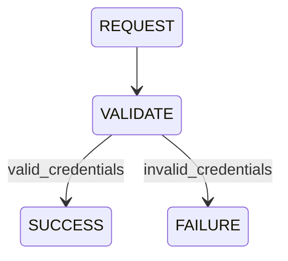

# 📚 Learning Librarian & Obsidian Vault Exporter

The **Learning Librarian** (`brain/librarian.py`) acts as the knowledge synchronizer between the Neo4j-based memory representation (`codebase-memory-mcp`) and a human-readable local Obsidian vault.

---

## 1. Vault Directory Structure

When `setup_vault()` is run, the engine creates the following folder hierarchy under the configured vault path:

```text
obsidian_vault/
 ├── symbols/               # Exported symbol pages (functions, classes, variables)
 ├── files/                 # File structural maps and file-level metrics
 ├── behaviors/             # User journeys, execution flows, and state machines
 ├── changes/
 │    ├── recent/           # High-relevance commits waiting for inspection
 │    └── archive/          # Archived historical changes
 ├── rules/                 # Extracted coding invariants and business policies
 └── baseline.md            # Original HEAD state baseline snapshot
```

---

## 2. Concurrency Locking (.qbrain.lock)

To prevent multiple background processes, daemons, or CLI invocations from modifying or corrupting the vault simultaneously, the librarian uses a PID-based locking mechanism:

1. **Acquire**: Writes a `.qbrain.lock` file to the repository root containing the current process's PID.
2. **Collision Check**: If the file exists, it reads the PID and verifies if the process is active using system calls (`psutil` or `tasklist` fallbacks). If running, it raises a `RuntimeError` preventing concurrent access.
3. **Release**: Safely removes `.qbrain.lock` upon block completion or when an exception occurs.

---

## 3. Behavior Flow Dual-Representation

Behaviors are written to the vault using a hybrid markdown format designed for both human visualization and machine-parsing:

- **Human Visualization**: Mermaid class/state diagrams (`stateDiagram-v2`) showing states, flows, and execution path conditions.
- **Machine/LLM Representation**: Structured YAML Frontmatter metadata containing states lists, endpoints, triggers, and signatures.

```markdown
---
type: behavior
name: auth-flow
states: [REQUEST, VALIDATE, SUCCESS, FAILURE]
---

# Behavior: auth-flow

## State Machine


```

---

## 4. Greenfield Initialization Fallback

If `quant-blm` is initialized or indexed in a workspace directory where `.git` is missing:

1. It runs `git init` to set up local version control.
2. It generates a default rules configuration `.qbrain-rules.yaml` prescribing keep thresholds, weights for commits, and glob filters.
3. It initializes the baseline vault template folder structure for developers to start recording architecture decisions.
4. The brain analyzes user-provided keywords (e.g., "high-throughput payment gateway", "solidity dex", "real-time chat service") and outputs:
   - A recommended tech stack (e.g., choice of language, databases, frameworks).
   - A custom `.qbrain-rules.yaml` containing matching keywords, weights, and parsing regexes tailored to the selected languages.
   - A step-by-step implementation plan and architectural guidelines to write code that aligns with the target design.

---

## 5. Docstring & Quality Invariants Warnings

During `qbrain library sync`, the system evaluates the structural completeness of each symbol's documentation:
- **Missing Docstrings**: Triggers a warning if a function or method has an empty or missing comment block.
- **Malformed Docstrings**: Compares signature parameters against documented `@param` parameters. For languages like Python, JS/TS, C++, Go, Rust, and Solidity, a warning is raised if parameters declared in the signature are completely undocumented.
- **Reporting**: Discovered violations are compiled and saved to `rules/warnings.md` in the Obsidian vault, using standard Markdown tables with internal linkages.
